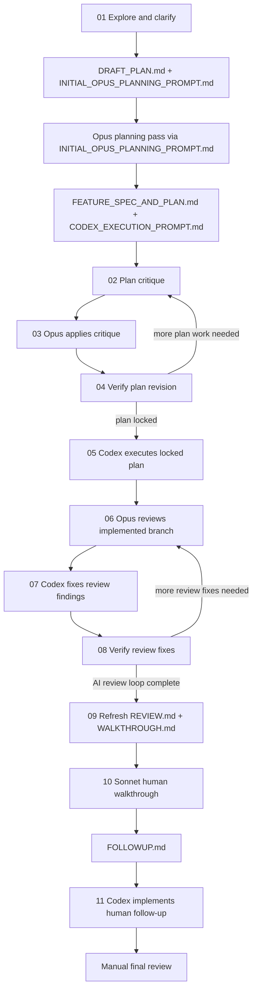

# ai-coding-workflow

This repository is a curated, phase-based prompt pack for an agentic coding workflow.

It is not an application codebase. It is a working set of self-contained Markdown prompts, source material, and design history for a strict multi-model workflow that moves through:

idea clarification -> planning -> plan critique -> locked execution -> AI review loop -> human walkthrough -> final human-approved follow-up execution

The main value of this repo is not "one magic prompt." The value is the workflow contract:

- each reusable checked-in step has a dedicated prompt, and `01` generates the dedicated Opus planning prompt artifact for the main planning pass,
- each prompt links only the skills that belong in that phase,
- each phase emits explicit artifacts,
- the next phase consumes those artifacts,
- review and follow-up are treated as separate loops,
- human approval remains a first-class gate.

## Table of Contents

- [What this repo is](#what-this-repo-is)
- [Where this workflow came from](#where-this-workflow-came-from)
- [Core design decisions](#core-design-decisions)
- [Repository layout](#repository-layout)
- [Workflow at a glance](#workflow-at-a-glance)
- [Artifact lifecycle](#artifact-lifecycle)
- [Skill model](#skill-model)
- [Prompt pack table of contents](#prompt-pack-table-of-contents)
- [Prompt-by-prompt deep dive](#prompt-by-prompt-deep-dive)
  - [Prompt 00 - Pack README](#prompt-00---pack-readme)
  - [Prompt 01 - Initial exploration](#prompt-01---initial-exploration)
  - [Prompt 02 - Plan critique loop](#prompt-02---plan-critique-loop)
  - [Prompt 03 - Opus applies plan critique](#prompt-03---opus-applies-plan-critique)
  - [Prompt 04 - Plan revision verification](#prompt-04---plan-revision-verification)
  - [Prompt 05 - Codex executes locked plan](#prompt-05---codex-executes-locked-plan)
  - [Prompt 06 - Opus reviews implemented branch](#prompt-06---opus-reviews-implemented-branch)
  - [Prompt 07 - Codex fixes Opus review findings](#prompt-07---codex-fixes-opus-review-findings)
  - [Prompt 08 - Opus verifies review fixes](#prompt-08---opus-verifies-review-fixes)
  - [Prompt 09 - Opus refreshes final review docs](#prompt-09---opus-refreshes-final-review-docs)
  - [Prompt 10 - Sonnet human walkthrough](#prompt-10---sonnet-human-walkthrough)
  - [Prompt 11 - Codex implements human follow-up](#prompt-11---codex-implements-human-follow-up)
- [Engineering contract summary](#engineering-contract-summary)
- [How to use this repo end to end](#how-to-use-this-repo-end-to-end)
- [Common entry points](#common-entry-points)
- [What is intentionally not in this repo](#what-is-intentionally-not-in-this-repo)
- [Maintenance and source material](#maintenance-and-source-material)

## What this repo is

This repo is the checked-in version of a strict prompt workflow for coding tasks that need:

- deliberate clarification before planning,
- detailed planning before implementation,
- explicit critique before execution,
- strict execution against a locked plan,
- structured review against both `main` and the plan,
- a human-guided walkthrough before the final follow-up pass.

The prompt pack is intentionally split into separate files so each prompt can be dropped directly into a model session at the right phase.

That means the repo optimizes for:

- explicit sequencing,
- self-contained prompts,
- explicit artifact handoffs,
- clear model-role boundaries,
- reproducible loops instead of ad hoc improvisation.

## Where this workflow came from

The current repo is best understood as the result of three inputs that were refined together:

1. `sources/original_scrappy_prompts.txt`
   - The raw earlier prompt set.
2. `sources/chat_exports/ChatGPT-Workflow and Skills Integration.json`
   - The design conversation that explains how the raw workflow was reorganized and how skills were assigned to phases.
3. `sources/ai_talk.pdf`
   - Referenced in the chat export as the original workflow basis, specifically pages 24-32.

The chat export is especially important because it captures the key decisions that shaped the final repo:

- only include skills that fit the existing workflow,
- do not turn the workflow into a broad skill soup,
- do not use a skill router in the final prompt pack,
- include explicit skill links inside the prompts themselves,
- keep prompts independent and self-contained,
- preserve all important detail from the original prompt set,
- reduce repetition where possible without losing self-containment,
- combine spec and implementation plan into one default planning artifact,
- keep `CODEX_EXECUTION_PROMPT.md` separate,
- preserve a strict human approval gate for final follow-up work.

In other words: this repo is not just "prompts plus links." It is a deliberately reorganized version of a pre-existing workflow with explicit tradeoffs recorded in the chat history.

## Core design decisions

These are the most important design choices in the current repo.

### 1. No skill router

The chat export explicitly rejects a generic router approach.

Instead:

- each prompt lists only the skills relevant to that phase,
- `01` tells GPT/Codex to generate the downstream Opus planning prompt artifact with the required embedded skill links, and downstream prompts tell review/revision models to generate the next request artifacts when appropriate,
- the prompt always overrides the skill.

### 2. Self-contained prompt files

Every prompt is meant to be copy-paste ready on its own.

That is why some duplication is intentional:

- repeated skill-handling rules,
- repeated Engineering Contract blocks,
- repeated artifact references,
- repeated guardrails around scope and verification.

This duplication is a feature, not a mistake.

### 3. Combined planning artifact by default

The workflow used to think in terms of separate `SPEC.md` and `IMPLEMENTATION_PLAN.md`.

The current default is:

- `FEATURE_SPEC_AND_PLAN.md`
- `CODEX_EXECUTION_PROMPT.md`

`FEATURE_SPEC_AND_PLAN.md` preserves the old split logically inside one file:

- spec/reference section = deeper rationale and reference material,
- implementation plan section = concrete execution contract.

The plan section is expected to link back to reference anchors in the same file rather than duplicate them.

### 4. Repetition reduced by an embedded Engineering Contract

The original workflow had duplication across Codex implementation instructions and Opus review instructions.

The repo reduces that repetition by embedding a shared Engineering Contract into the prompts that need it.

That contract carries the recurring policies around:

- strict plan adherence,
- no divergence,
- no creativity,
- no architecture changes,
- no tests unless explicitly asked,
- source-grounded implementation,
- backwards compatibility,
- cross-platform Windows/Linux behavior,
- verification before claiming completion.

### 5. Human review remains a real gate

The workflow does not end at the AI review loop.

After the AI review/fix loop is done:

- Opus refreshes `REVIEW.md` and `WALKTHROUGH.md`,
- Sonnet walks the human through the diff in small chunks,
- only explicitly agreed items go into `FOLLOWUP.md`,
- only then does Codex implement the human-approved follow-up list.

This is one of the most important characteristics of the repo.

## Repository layout

```text
.
+-- AGENTS.md
+-- README.md
+-- LICENSE
+-- .gitattributes
+-- archived/
|   +-- agentic_coding_prompt_pack_refactored.md
+-- prompts/
|   +-- 00_README.md
|   +-- 01_initial_exploration_gpt_codex.md
|   +-- 02_plan_critique_gpt_gemini_codex.md
|   +-- 03_opus_apply_plan_critique.md
|   +-- 04_plan_revision_verification_gpt_gemini_codex.md
|   +-- 05_codex_execute_locked_plan.md
|   +-- 06_opus_review_branch.md
|   +-- 07_codex_fix_opus_review_findings.md
|   +-- 08_opus_verify_review_fixes.md
|   +-- 09_opus_refresh_review_and_walkthrough.md
|   +-- 10_sonnet_human_code_walkthrough.md
|   +-- 11_codex_implement_human_followup.md
+-- sources/
    +-- ai_talk.pdf
    +-- current_skill_set.txt
    +-- original_scrappy_prompts.txt
    +-- Prompt Engineering for Claude Sonnet (4.5+) – Analytical Report.pdf
    +-- Prompting Claude Opus for High-Performance Results.pdf
    +-- Prompting GPT and Codex for Reliable Results.pdf
    +-- chat_exports/
        +-- ChatGPT-Workflow and Skills Integration.json
```

### What each top-level area is for

- `README.md`
  - The repo-level overview you are reading now.
- `AGENTS.md`
  - Repository maintenance guidance for future agents editing the pack.
- `prompts/`
  - The canonical prompt-pack surface.
- `sources/`
  - Raw/reference inputs that explain how the workflow was derived.
- `archived/`
  - Historical consolidated artifact, useful for reference or audit, but not the main editing surface.

## Workflow at a glance



### Important structural notes

- Prompt `01` creates the exploration outputs and the final paste-ready Opus planning prompt artifact.
- There is no separate checked-in prompt file for the main Opus planning phase; that phase is driven by the generated `INITIAL_OPUS_PLANNING_PROMPT.md` artifact.
- Prompts `02` -> `03` -> `04` are the plan-locking loop.
- Prompts `06` -> `07` -> `08` are the AI code review/fix loop.
- Prompt `09` exists so `REVIEW.md` and `WALKTHROUGH.md` reflect the final post-fix code, not a stale earlier snapshot.
- Prompts `10` and `11` are a separate human-reviewed final pass, not an extension of the AI review loop.

## Artifact lifecycle

One of the fastest ways to understand this repo is to understand the artifact chain.

| Artifact | Created in | Consumed in | Purpose |
|---|---|---|---|
| `DRAFT_PLAN.md` | `01` | Opus planning pass via `INITIAL_OPUS_PLANNING_PROMPT.md` | First structured articulation of the task after clarification. |
| `INITIAL_OPUS_PLANNING_PROMPT.md` | `01` | Opus planning pass | Final paste-ready Opus planning prompt generated during exploration. |
| `FEATURE_SPEC_AND_PLAN.md` | Opus planning pass, updated in `03` | `02`, `04`, `05`, `06`, `07`, `08`, `09`, `11` | Combined spec/reference plus execution contract. |
| `CODEX_EXECUTION_PROMPT.md` | Opus planning pass, updated in `03` | `02`, `04`, `05`, `06` | End-to-end implementation prompt for Codex. |
| `PLAN_CRITIQUE.md` | `02` | `03`, `04` | Records critique findings against the planning artifacts. |
| `OPUS_PLAN_REVISION_REQUEST.md` | `02`, optionally regenerated in `04` | `03` | Self-contained request for Opus to revise the plan and Codex prompt. |
| `PLAN_REVISION_SUMMARY.md` | `03` | `04` | Explains what changed in the planning artifacts after critique. |
| `PLAN_REVISION_VERIFICATION.md` | `04` | Human decision point before moving to `05` | Confirms whether the plan is ready for locked execution. |
| `REVIEW.md` | `06`, refreshed in `09` | `07`, `08`, `10`, `11` | Formal post-implementation review document. |
| `WALKTHROUGH.md` | `06`, refreshed in `09` | `07`, `08`, `10`, `11` | Detailed beginner-friendly walkthrough of the change set. |
| `CODEX_REVIEW_FIX_PROMPT.md` | `06` | `07`, optionally `08` context | Self-contained request for Codex to fix valid review findings. |
| `REVIEW_FIX_VERIFICATION.md` | `08` | `09` | Confirms whether the review-fix pass actually resolved the issues. |
| `FOLLOWUP.md` | `10` | `11` | Human-approved final follow-up checklist. |

### Why this matters

This repo is not just a stack of prompts. It is a chain of prompt-driven artifacts.

If you skip the artifact model, the prompt pack looks more complicated than it is.

If you follow the artifact model, the workflow becomes much easier to understand:

- one phase creates the contract,
- the next phase audits the contract,
- the next phase executes it,
- the next phase audits the implementation,
- the last phase lets the human tighten the last mile.

## Skill model

The checked-in skill inventory is summarized in [sources/current_skill_set.txt](sources/current_skill_set.txt).

The chat export makes clear that the intended model is not "use every interesting skill." The intended model is:

- keep a small default set,
- assign skills by workflow phase,
- treat skills as support procedures,
- let the prompt and locked artifacts override the skill.

### Canonical phase-to-skill mapping

| Phase | Skills |
|---|---|
| Define / Clarify | `interview-me`, `grill-me`, `idea-refine` |
| Plan | `spec-driven-development`, `planning-and-task-breakdown`, `context-engineering`, `source-driven-development` |
| Critique / Lock Plan | `code-review-and-quality`, `code-simplification`, `source-driven-development`, `verification-before-completion` |
| Execute | `incremental-implementation`, `source-driven-development`, `verification-before-completion` |
| Review | `code-review-and-quality`, `code-simplification`, `source-driven-development`, `verification-before-completion` |
| Review Follow-up | `receiving-code-review`, `code-review-and-quality` |
| Follow-up Execution | `incremental-implementation`, `receiving-code-review`, `verification-before-completion`, `source-driven-development` |

### What the chosen skills are doing in this repo

The chat export provides the rationale behind the chosen stack:

- `interview-me`
  - Extracts what the user actually wants when the ask is still vague.
- `grill-me`
  - Pressure-tests the design rather than accepting the first plausible plan.
- `idea-refine`
  - Turns a rough concept into a more concrete proposal.
- `spec-driven-development`
  - Forces explicit planning before implementation.
- `planning-and-task-breakdown`
  - Turns a broad spec into concrete units of work.
- `context-engineering`
  - Helps control what repo context gets loaded and avoids context overload.
- `source-driven-development`
  - Grounds framework and library decisions in documentation or source.
- `incremental-implementation`
  - Encourages small, verifiable implementation steps.
- `verification-before-completion`
  - Prevents "done" claims without actual verification evidence.
- `code-review-and-quality`
  - Provides structured review lenses before merge.
- `code-simplification`
  - Looks for complexity that can be reduced without changing behavior.
- `receiving-code-review`
  - Treats review comments as claims to validate, not blindly execute.

### What was explicitly rejected

The chat export also records several deliberate exclusions:

- no general skill router,
- no broad autoloading of extra skills,
- no automatic expansion into unrelated skill categories,
- no assumption that "popular" skills should replace the workflow's proven set,
- no blind import of full external skill packs.

The best way to think about the skills in this repo is:

the workflow comes first, the skills are phase-local helpers.

## Prompt pack table of contents

This is the fastest file-by-file map of the prompt pack.

| Step | File | Primary model / role | Use when | Main outputs or result |
|---|---|---|---|---|
| 00 | [prompts/00_README.md](prompts/00_README.md) | Human reader | You want the prompt-pack companion README inside `prompts/` | Overview of the pack |
| 01 | [prompts/01_initial_exploration_gpt_codex.md](prompts/01_initial_exploration_gpt_codex.md) | GPT or Codex | The idea is still vague and needs clarification | `DRAFT_PLAN.md`, `INITIAL_OPUS_PLANNING_PROMPT.md` |
| 02 | [prompts/02_plan_critique_gpt_gemini_codex.md](prompts/02_plan_critique_gpt_gemini_codex.md) | GPT, Gemini, or Codex | The Opus planning artifacts already exist and need critique before execution | `PLAN_CRITIQUE.md`, `OPUS_PLAN_REVISION_REQUEST.md` |
| 03 | [prompts/03_opus_apply_plan_critique.md](prompts/03_opus_apply_plan_critique.md) | Claude Opus | Critique exists and the planning artifacts must be revised | Updated `FEATURE_SPEC_AND_PLAN.md`, updated `CODEX_EXECUTION_PROMPT.md`, `PLAN_REVISION_SUMMARY.md` |
| 04 | [prompts/04_plan_revision_verification_gpt_gemini_codex.md](prompts/04_plan_revision_verification_gpt_gemini_codex.md) | GPT, Gemini, or Codex | You need to verify whether the revised plan actually fixed the critique | `PLAN_REVISION_VERIFICATION.md`, optionally a new `OPUS_PLAN_REVISION_REQUEST.md` |
| 05 | [prompts/05_codex_execute_locked_plan.md](prompts/05_codex_execute_locked_plan.md) | Codex | The plan is locked and implementation can start | Code changes plus execution summary |
| 06 | [prompts/06_opus_review_branch.md](prompts/06_opus_review_branch.md) | Claude Opus | Implementation is done and the branch needs formal review | `REVIEW.md`, `WALKTHROUGH.md`, `CODEX_REVIEW_FIX_PROMPT.md` |
| 07 | [prompts/07_codex_fix_opus_review_findings.md](prompts/07_codex_fix_opus_review_findings.md) | Codex | Valid review findings need to be fixed | Code changes plus review-fix summary |
| 08 | [prompts/08_opus_verify_review_fixes.md](prompts/08_opus_verify_review_fixes.md) | Claude Opus | The review fixes need an audit before the loop ends | `REVIEW_FIX_VERIFICATION.md` |
| 09 | [prompts/09_opus_refresh_review_and_walkthrough.md](prompts/09_opus_refresh_review_and_walkthrough.md) | Claude Opus | The AI review loop is complete and the docs need a final refresh | Refreshed `REVIEW.md`, refreshed `WALKTHROUGH.md` |
| 10 | [prompts/10_sonnet_human_code_walkthrough.md](prompts/10_sonnet_human_code_walkthrough.md) | Claude Sonnet with human in the loop | Final human review and approval pass | Human-vetted `FOLLOWUP.md` |
| 11 | [prompts/11_codex_implement_human_followup.md](prompts/11_codex_implement_human_followup.md) | Codex | `FOLLOWUP.md` contains only human-approved items | Code changes plus human follow-up implementation summary |

Important note:

- The main Opus planning pass happens between `01` and `02`.
- It is driven by the generated `INITIAL_OPUS_PLANNING_PROMPT.md` artifact rather than a separate checked-in prompt file.

## Prompt-by-prompt deep dive

This section is intentionally detailed so you do not have to reverse-engineer the prompt pack by opening files one at a time.

### Prompt 00 - Pack README

File: [prompts/00_README.md](prompts/00_README.md)

What it is:

- A prompt-pack companion README that lives inside `prompts/`.
- It is not one of the actual workflow phases.

What it explains:

- why the pack uses independent prompts,
- why the Engineering Contract exists,
- why `FEATURE_SPEC_AND_PLAN.md` is the default planning artifact,
- why `CODEX_EXECUTION_PROMPT.md` remains separate,
- which skill links are used across the pack.

Why it exists:

- so the prompt pack can be shared or zipped as a standalone folder,
- so someone opening only `prompts/` still gets context,
- so the design decisions travel with the prompts.

### Prompt 01 - Initial exploration

File: [prompts/01_initial_exploration_gpt_codex.md](prompts/01_initial_exploration_gpt_codex.md)

Primary role:

- Clarify the task before detailed planning begins and generate the final paste-ready Opus planning prompt artifact.

Target model:

- GPT or Codex.

Skills used:

- `interview-me`
- `grill-me`
- `idea-refine`
- `context-engineering`

What it does:

- turns a vague idea into a structured draft,
- keeps the session interactive,
- asks one question at a time when needed,
- encourages codebase exploration instead of unnecessary questioning,
- explicitly forbids implementation and test writing at this stage,
- generates the actual `INITIAL_OPUS_PLANNING_PROMPT.md` artifact that is pasted into Opus for the main planning pass.

Artifacts it creates:

- `DRAFT_PLAN.md`
- `INITIAL_OPUS_PLANNING_PROMPT.md`

Why it matters:

- it prevents the rest of the workflow from starting on a fuzzy task,
- it produces the draft material that the Opus planning phase expands into a real execution contract,
- it produces the direct Opus planning prompt artifact itself rather than a helper prompt,
- it encodes the expectation that the user goal, constraints, non-goals, and definition of done must be clear before planning hardens.

What happens next:

- `INITIAL_OPUS_PLANNING_PROMPT.md` is pasted into Opus.
- Opus uses that generated prompt plus `DRAFT_PLAN.md` and repository context to create `FEATURE_SPEC_AND_PLAN.md` and `CODEX_EXECUTION_PROMPT.md`.
- The generated Opus planning prompt carries the planning-phase skill links and execution-contract requirements that used to live in separate checked-in planning prompt files.

Use this when:

- the request is underspecified,
- the repo context is large and you need a scoped task statement first,
- you want early questioning before locking yourself into a plan.

### Prompt 02 - Plan critique loop

File: [prompts/02_plan_critique_gpt_gemini_codex.md](prompts/02_plan_critique_gpt_gemini_codex.md)

Primary role:

- Audit the planning artifacts before any implementation begins.

Target model:

- GPT, Gemini, or Codex.

Skills used:

- `code-review-and-quality`
- `code-simplification`
- `source-driven-development`
- `verification-before-completion`

What it does:

- critiques `FEATURE_SPEC_AND_PLAN.md`,
- critiques `CODEX_EXECUTION_PROMPT.md`,
- checks for missing questions, edge cases, API risks, scope drift, performance risks, backwards compatibility risks, and prompt looseness,
- produces both a critique document and a revision request for Opus.

Required outputs:

- `PLAN_CRITIQUE.md`
- `OPUS_PLAN_REVISION_REQUEST.md`

Why it exists:

- to stop the workflow from moving straight from planning to coding without a structured challenge pass,
- to make the plan-locking step explicit rather than informal.

### Prompt 03 - Opus applies plan critique

File: [prompts/03_opus_apply_plan_critique.md](prompts/03_opus_apply_plan_critique.md)

Primary role:

- Revise the planning artifacts after critique.

Target model:

- Claude Opus.

Skills used:

- planning skills,
- documentation/source-grounding skills,
- review/simplification skills.

What it does:

- reads the critique,
- updates the combined plan/spec,
- updates the Codex execution prompt,
- preserves scope,
- refuses to use critique as permission for stealth architecture change,
- records what was changed and what was not.

Required outputs:

- updated `FEATURE_SPEC_AND_PLAN.md`
- updated `CODEX_EXECUTION_PROMPT.md`
- `PLAN_REVISION_SUMMARY.md`

Why the summary file matters:

- it gives the next verifier something concrete to audit,
- it makes the plan revision loop evidence-based instead of vague.

### Prompt 04 - Plan revision verification

File: [prompts/04_plan_revision_verification_gpt_gemini_codex.md](prompts/04_plan_revision_verification_gpt_gemini_codex.md)

Primary role:

- Verify whether the plan revision actually resolved the previous critique.

Target model:

- GPT, Gemini, or Codex.

Skills used:

- `code-review-and-quality`
- `code-simplification`
- `source-driven-development`
- `verification-before-completion`

What it does:

- compares the previous critique to the revised artifacts,
- classifies each concern as resolved, partially resolved, not resolved, or invalid,
- decides whether the workflow is ready to move to execution,
- optionally creates the next revision request if concerns remain.

Required output:

- `PLAN_REVISION_VERIFICATION.md`

Conditional output:

- a new `OPUS_PLAN_REVISION_REQUEST.md` if the plan is still not ready.

Why it exists:

- to close the loop on planning rigor,
- to avoid the common failure mode where a revised plan is assumed to be fixed without a real audit.

### Prompt 05 - Codex executes locked plan

File: [prompts/05_codex_execute_locked_plan.md](prompts/05_codex_execute_locked_plan.md)

Primary role:

- Execute the locked implementation plan.

Target model:

- Codex.

Skills used:

- `incremental-implementation`
- `source-driven-development`
- `verification-before-completion`

What it does:

- reads `FEATURE_SPEC_AND_PLAN.md`,
- optionally reads `CODEX_EXECUTION_PROMPT.md`,
- treats the implementation-plan section as the execution contract,
- explicitly forbids divergence, creativity, and architecture changes,
- allows interruption only when there is ambiguity, conflict, or insufficient context.

Required final response shape:

- a structured execution summary with what changed, files changed, plan steps completed, verification evidence, documentation updates, commits, and out-of-scope suggestions.

Why it matters:

- this is the point where the workflow cashes in the planning effort,
- the quality of this phase depends heavily on the artifacts produced by the Opus planning pass from `INITIAL_OPUS_PLANNING_PROMPT.md` and refined in `03`.

### Prompt 06 - Opus reviews implemented branch

File: [prompts/06_opus_review_branch.md](prompts/06_opus_review_branch.md)

Primary role:

- Perform the post-implementation AI review.

Target model:

- Claude Opus.

Skills used:

- `code-review-and-quality`
- `code-simplification`
- `source-driven-development`
- `verification-before-completion`

What it does:

- compares the current branch against `main`,
- compares the implementation against the plan artifacts,
- reviews for readability, quality, performance, backwards compatibility, API behavior, reuse, documentation grounding, comments, test quality, and cross-platform safety,
- creates both a review artifact and a teaching artifact.

Required outputs:

- `REVIEW.md`
- `WALKTHROUGH.md`
- `CODEX_REVIEW_FIX_PROMPT.md`

What makes this phase distinctive:

- `REVIEW.md` is the formal decision artifact,
- `WALKTHROUGH.md` is intentionally line-by-line and beginner-oriented,
- the generated Codex fix prompt must address valid findings only.

Why it exists:

- because the workflow does not treat execution as the last quality gate,
- because review is not just "spot bugs"; it is also about divergence, contract adherence, and maintainability.

### Prompt 07 - Codex fixes Opus review findings

File: [prompts/07_codex_fix_opus_review_findings.md](prompts/07_codex_fix_opus_review_findings.md)

Primary role:

- Fix the valid findings from the Opus review.

Target model:

- Codex.

Skills used:

- `incremental-implementation`
- `source-driven-development`
- `verification-before-completion`
- `receiving-code-review`

What it does:

- reads `REVIEW.md`,
- uses `WALKTHROUGH.md` as context,
- optionally uses `CODEX_REVIEW_FIX_PROMPT.md`,
- addresses only the valid required review findings,
- preserves scope and backwards compatibility,
- refuses to implement optional suggestions unless explicitly approved.

Required final response shape:

- a structured review-fix summary with fixed items, not-fixed items, files changed, verification evidence, documentation updates, commits, and blockers.

Why `receiving-code-review` belongs here:

- because review comments are treated as claims to validate, not instructions to obey blindly.

### Prompt 08 - Opus verifies review fixes

File: [prompts/08_opus_verify_review_fixes.md](prompts/08_opus_verify_review_fixes.md)

Primary role:

- Audit whether the review-fix pass actually resolved the issues.

Target model:

- Claude Opus.

Skills used:

- `code-review-and-quality`
- `code-simplification`
- `source-driven-development`
- `verification-before-completion`
- `receiving-code-review`

What it does:

- compares the original review findings to the post-fix code,
- determines whether each required review item is resolved,
- identifies any newly introduced issues,
- decides whether the AI review loop should continue or end.

Required output:

- `REVIEW_FIX_VERIFICATION.md`

Why it exists:

- to avoid assuming that "fixes were made" means "review items were resolved,"
- to provide an explicit stopping condition for the AI review loop.

### Prompt 09 - Opus refreshes final review docs

File: [prompts/09_opus_refresh_review_and_walkthrough.md](prompts/09_opus_refresh_review_and_walkthrough.md)

Primary role:

- Refresh the review documentation after the AI review loop is complete.

Target model:

- Claude Opus.

Skills used:

- `code-review-and-quality`
- `code-simplification`
- `source-driven-development`
- `verification-before-completion`

What it does:

- updates `REVIEW.md` so it reflects the final code rather than the pre-fix snapshot,
- updates `WALKTHROUGH.md` so it matches the final state as well,
- verifies that both docs actually reflect the end state.

Required outputs:

- refreshed `REVIEW.md`
- refreshed `WALKTHROUGH.md`

Why it exists:

- because stale review docs become actively misleading during the human walkthrough phase,
- because the final human reviewer should not be forced to mentally merge old docs with new code.

### Prompt 10 - Sonnet human walkthrough

File: [prompts/10_sonnet_human_code_walkthrough.md](prompts/10_sonnet_human_code_walkthrough.md)

Primary role:

- Human-in-the-loop final walkthrough and follow-up list creation.

Target model:

- Claude Sonnet.

Skills used:

- `receiving-code-review`
- `code-review-and-quality`
- `code-simplification`

What it does:

- uses `REVIEW.md` and `WALKTHROUGH.md` as aids, not as unquestionable truth,
- inspects the actual code and diff against `main`,
- shows the human no more than five lines of code at a time,
- explains what the code does,
- discusses review findings one section at a time,
- waits for explicit human approval before recording any follow-up item.

Key artifact rule:

- `FOLLOWUP.md` may contain only explicitly agreed items.

Important human gate:

- the human must type `AGREE` in all caps.

Why this phase is special:

- it is not the AI review/fix loop,
- it is the phase where the user takes control,
- it converts the final human review into a precise checklist rather than vague comments.

### Prompt 11 - Codex implements human follow-up

File: [prompts/11_codex_implement_human_followup.md](prompts/11_codex_implement_human_followup.md)

Primary role:

- Implement the human-approved follow-up list.

Target model:

- Codex.

Skills used:

- `incremental-implementation`
- `source-driven-development`
- `verification-before-completion`
- `receiving-code-review`

What it does:

- reads `FOLLOWUP.md`,
- treats `FOLLOWUP.md` as the execution contract for this phase,
- uses `REVIEW.md` and `WALKTHROUGH.md` only as supporting context,
- implements only explicitly listed items,
- refuses scope expansion,
- does not restart another AI review loop.

Required final response shape:

- a human follow-up implementation summary with completed items, incomplete items, files changed, verification evidence, docs updated, commits, and remaining manual review notes.

Why it is the final prompt:

- it completes the workflow after the human has made final targeted requests,
- it deliberately ends with manual review rather than another automated critique loop.

## Engineering contract summary

Many of the prompts repeat a shared Engineering Contract. That repetition is intentional.

At a high level, the contract enforces:

- follow the plan exactly when a plan exists,
- no divergence,
- no creativity,
- no architecture changes,
- stop and ask when there is ambiguity or conflict,
- do not change unrelated code unless absolutely necessary,
- do not introduce third-party libraries without explicit approval,
- ground framework/library work in real documentation,
- keep public API changes backwards compatible unless explicitly exempted,
- do not expose library-specific exceptions in public APIs,
- keep code DRY and reuse existing structures,
- do not use assert statements in production code,
- do not hardcode constants when a better home exists,
- keep changes cross-platform for Windows and Linux,
- do not write tests unless explicitly asked,
- use focused verification,
- do not claim completion without fresh verification evidence,
- update related documentation,
- do not write the changelog.

This contract is a big part of the workflow's personality. If you remove it, you are not just shortening prompts; you are changing the workflow.

## How to use this repo end to end

If you are starting from a vague feature or task idea, the default path is:

1. Start with [prompts/01_initial_exploration_gpt_codex.md](prompts/01_initial_exploration_gpt_codex.md).
2. Paste the generated `INITIAL_OPUS_PLANNING_PROMPT.md` into Opus and let it create `FEATURE_SPEC_AND_PLAN.md` plus `CODEX_EXECUTION_PROMPT.md`.
3. Critique the plan with [prompts/02_plan_critique_gpt_gemini_codex.md](prompts/02_plan_critique_gpt_gemini_codex.md).
4. Apply critique with [prompts/03_opus_apply_plan_critique.md](prompts/03_opus_apply_plan_critique.md).
5. Verify the revised plan with [prompts/04_plan_revision_verification_gpt_gemini_codex.md](prompts/04_plan_revision_verification_gpt_gemini_codex.md).
6. Repeat `02` -> `03` -> `04` until the plan is truly locked.
7. Execute with [prompts/05_codex_execute_locked_plan.md](prompts/05_codex_execute_locked_plan.md).
8. Review with [prompts/06_opus_review_branch.md](prompts/06_opus_review_branch.md).
9. Fix review findings with [prompts/07_codex_fix_opus_review_findings.md](prompts/07_codex_fix_opus_review_findings.md).
10. Verify the fixes with [prompts/08_opus_verify_review_fixes.md](prompts/08_opus_verify_review_fixes.md).
11. Repeat `06` -> `07` -> `08` until the AI review loop is done.
12. Refresh the final review docs with [prompts/09_opus_refresh_review_and_walkthrough.md](prompts/09_opus_refresh_review_and_walkthrough.md).
13. Run the human walkthrough with [prompts/10_sonnet_human_code_walkthrough.md](prompts/10_sonnet_human_code_walkthrough.md).
14. Implement the human-approved follow-up list with [prompts/11_codex_implement_human_followup.md](prompts/11_codex_implement_human_followup.md).
15. Perform your final manual review.

## Common entry points

You do not always need to start at `01`.

Use these shortcuts when appropriate:

- Start with the Opus planning phase directly
  - if clarification already happened and you already have a clean `DRAFT_PLAN.md` plus a satisfactory Opus planning prompt.
- Start at `02`
  - if the planning artifacts already exist and you only want to critique/lock them.
- Start at `05`
  - if the plan is already locked and you are ready to implement.
- Start at `06`
  - if implementation already exists and you only need the AI review loop.
- Start at `10`
  - if the AI review loop is done and you are entering the final human walkthrough.
- Start at `11`
  - if `FOLLOWUP.md` already exists and contains only human-approved work.

## What is intentionally not in this repo

This repo intentionally does not try to be:

- a generic skill router,
- a universal prompt library for every kind of work,
- a code generator,
- an automation framework,
- a single monolithic mega-prompt,
- a fully automated review replacement for the human.

It also intentionally does not check in runtime workflow artifacts like:

- `DRAFT_PLAN.md`
- `FEATURE_SPEC_AND_PLAN.md`
- `CODEX_EXECUTION_PROMPT.md`
- `PLAN_CRITIQUE.md`
- `REVIEW.md`
- `WALKTHROUGH.md`
- `FOLLOWUP.md`

Those are outputs of the workflow, not part of the default source pack.

## Maintenance and source material

If you want to maintain or extend the prompt pack itself:

- read [AGENTS.md](AGENTS.md) first,
- treat `prompts/` as the canonical editing surface,
- treat `archived/agentic_coding_prompt_pack_refactored.md` as historical/reference material unless you are explicitly updating the archive,
- use `sources/chat_exports/ChatGPT-Workflow and Skills Integration.json` when you need the rationale behind the current structure,
- use `sources/original_scrappy_prompts.txt` when you need to confirm that a refactor did not drop important older instructions.

### Most useful source files

- [sources/chat_exports/ChatGPT-Workflow and Skills Integration.json](sources/chat_exports/ChatGPT-Workflow%20and%20Skills%20Integration.json)
  - Best source for understanding why the current workflow is shaped this way.
- [sources/current_skill_set.txt](sources/current_skill_set.txt)
  - Fastest compact view of the intended skill-by-phase mapping.
- [sources/original_scrappy_prompts.txt](sources/original_scrappy_prompts.txt)
  - Best source for comparing current prompts against the pre-refactor workflow language.
- [prompts/00_README.md](prompts/00_README.md)
  - Pack-local overview for anyone entering through the `prompts/` directory.
- [archived/agentic_coding_prompt_pack_refactored.md](archived/agentic_coding_prompt_pack_refactored.md)
  - Consolidated historical reference, useful for audit and comparison.

### Bottom line

If you only remember five things about this repo, remember these:

1. This is a workflow repo, not an app repo.
2. The prompts are intentionally phase-specific and self-contained.
3. `FEATURE_SPEC_AND_PLAN.md` is the default planning contract.
4. There are two explicit AI loops and one final human loop.
5. The workflow ends with human-approved follow-up execution, not blind automation.
