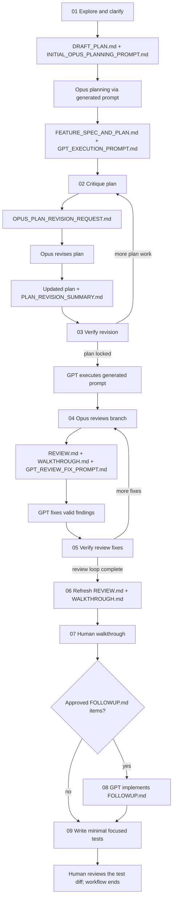

# AI Coding Workflow

A phase-based prompt pack for moving a coding task from clarification to planning, implementation, review, human approval, and focused tests.

This repository is the workflow source, not the application being changed. Copy each checked-in prompt into a fresh model session with the target code repository open. Runtime artifacts such as `DRAFT_PLAN.md`, `FEATURE_SPEC_AND_PLAN.md`, and `REVIEW.md` belong in the target repository root.

## Workflow



Generated prompt artifacts are the only prompt input for their handoff:

- `INITIAL_OPUS_PLANNING_PROMPT.md` drives the main Opus planning pass.
- `OPUS_PLAN_REVISION_REQUEST.md` drives an Opus plan-revision pass.
- `GPT_EXECUTION_PROMPT.md` drives locked GPT implementation.
- `GPT_REVIEW_FIX_PROMPT.md` drives a GPT review-fix pass.

If a generated prompt is incomplete, return to its producer phase instead of inventing a parallel checked-in prompt.

## Prompt Index

| Step | Prompt | Model / role | Result |
|---|---|---|---|
| 01 | [Initial exploration](prompts/01_initial_exploration_any_model.md) | Any capable repo-aware model | `DRAFT_PLAN.md`, `INITIAL_OPUS_PLANNING_PROMPT.md` |
| 02 | [Plan critique](prompts/02_plan_critique_gpt_gemini.md) | GPT or Gemini | `PLAN_CRITIQUE.md`, `OPUS_PLAN_REVISION_REQUEST.md` |
| 03 | [Plan-revision verification](prompts/03_plan_revision_verification_gpt_gemini.md) | GPT or Gemini | `PLAN_REVISION_VERIFICATION.md` |
| 04 | [Implemented-branch review](prompts/04_opus_review_branch.md) | Claude Opus | `REVIEW.md`, `WALKTHROUGH.md`, `GPT_REVIEW_FIX_PROMPT.md` |
| 05 | [Review-fix verification](prompts/05_opus_verify_review_fixes.md) | Claude Opus | `REVIEW_FIX_VERIFICATION.md` |
| 06 | [Final review-artifact refresh](prompts/06_opus_refresh_review_and_walkthrough.md) | Claude Opus | Refreshed `REVIEW.md` and `WALKTHROUGH.md` |
| 07 | [Human code walkthrough](prompts/07_human_code_walkthrough.md) | GPT or Claude Sonnet with a human | Human-approved `FOLLOWUP.md`, when needed |
| 08 | [Human follow-up implementation](prompts/08_gpt_implement_human_followup.md) | GPT | Approved follow-up changes |
| 09 | [Focused test writing](prompts/09_write_focused_tests_any_model.md) | Any capable repo-aware model | Test-file changes only, followed by human review |

The main Opus planning pass, Opus plan-revision pass, locked GPT execution pass, and GPT review-fix pass use generated prompts, so they do not have separate checked-in phase files.

## How to Run It

1. Open the target code repository in a repo-aware agent UI. Keep this prompt pack available only as the instruction source.
2. Run [prompt 01](prompts/01_initial_exploration_any_model.md) with the task. It creates `DRAFT_PLAN.md` and `INITIAL_OPUS_PLANNING_PROMPT.md`.
3. Paste `INITIAL_OPUS_PLANNING_PROMPT.md` into Opus. Save the resulting `FEATURE_SPEC_AND_PLAN.md` and `GPT_EXECUTION_PROMPT.md`.
4. Run [prompt 02](prompts/02_plan_critique_gpt_gemini.md). If revision is required, paste its generated `OPUS_PLAN_REVISION_REQUEST.md` into Opus.
5. Run [prompt 03](prompts/03_plan_revision_verification_gpt_gemini.md). Repeat `02 -> Opus revision -> 03` until the plan is locked.
6. Paste `GPT_EXECUTION_PROMPT.md` into GPT to implement `FEATURE_SPEC_AND_PLAN.md`.
7. Run [prompt 04](prompts/04_opus_review_branch.md). If it creates `GPT_REVIEW_FIX_PROMPT.md`, paste that generated prompt into GPT, then run [prompt 05](prompts/05_opus_verify_review_fixes.md). Repeat until all valid blocking and non-blocking findings are resolved.
8. Run [prompt 06](prompts/06_opus_refresh_review_and_walkthrough.md), then perform the independent human review with [prompt 07](prompts/07_human_code_walkthrough.md).
9. If the human approves follow-up work, record it in `FOLLOWUP.md` and run [prompt 08](prompts/08_gpt_implement_human_followup.md).
10. Run [prompt 09](prompts/09_write_focused_tests_any_model.md) against the final branch state.
11. Human-review the resulting test diff. Do not start another AI phase or create another workflow artifact.

Use a fresh chat for each major phase or model handoff. The artifact files, not hidden chat history, are the handoff boundary.

## Operator Rules

- Run the workflow in the target code repository, never in this prompt-pack repository.
- Store every workflow-generated Markdown artifact in the target repository root under its exact required filename.
- Give each generated artifact `Created by`, `Created at`, and `Updated at` fields. Preserve the creation fields and refresh `Updated at` on edits.
- Treat the implementation-plan section of `FEATURE_SPEC_AND_PLAN.md` as the execution contract and its spec/reference section as context.
- Use the checked-in prompt for checked-in phases and the generated artifact for generated phases.
- Do not stage or commit workflow-generated Markdown artifacts unless explicitly requested.
- Execution phases verify their work, stage intended source/test changes, create focused commits, push the current branch, and create a pull request only when that branch does not already have one. GitHub CLI (`gh`) is the fallback for checking PR existence.
- Stop and ask when required decisions, repository facts, or instructions conflict. Do not fill material gaps with assumptions.

## Artifact Chain

| Artifact | Producer | Main consumer |
|---|---|---|
| `DRAFT_PLAN.md` | 01 | Generated Opus planning prompt |
| `INITIAL_OPUS_PLANNING_PROMPT.md` | 01 | Main Opus planning pass |
| `FEATURE_SPEC_AND_PLAN.md` | Opus planning/revision | Critique, execution, and review phases |
| `GPT_EXECUTION_PROMPT.md` | Opus planning/revision | Locked GPT execution |
| `PLAN_CRITIQUE.md` | 02 | Opus revision and 03 |
| `OPUS_PLAN_REVISION_REQUEST.md` | 02 | Opus revision |
| `PLAN_REVISION_SUMMARY.md` | Opus revision | 03 |
| `PLAN_REVISION_VERIFICATION.md` | 03 | Execution gate |
| `REVIEW.md` | 04, refreshed by 06 | GPT review-fix context and later workflow context |
| `WALKTHROUGH.md` | 04, refreshed by 06 | GPT review-fix and human walkthrough context |
| `GPT_REVIEW_FIX_PROMPT.md` | 04 | GPT review-fix pass |
| `REVIEW_FIX_VERIFICATION.md` | 05 | 06 |
| `FOLLOWUP.md` | 07 | 08 |

Prompt 09 changes test files only. It must not create another prompt, review, walkthrough, plan, summary, or workflow Markdown artifact, and it must not leave generated coverage output in the repository. Human review of the test diff ends the workflow.

## Core Design

- One prompt input per phase. A generated downstream prompt replaces a separate checked-in prompt for that handoff.
- Prompts are self-contained. Repeated skill and Engineering Contract blocks are intentional.
- No skill router. Each prompt lists only the supporting skills relevant to its phase, and the prompt always wins over a skill.
- The default planning output is one combined `FEATURE_SPEC_AND_PLAN.md` plus a separate `GPT_EXECUTION_PROMPT.md`. Separate `SPEC.md` and `IMPLEMENTATION_PLAN.md` files are fallback-only.
- Model roles stay explicit: any capable repo-aware model for exploration and final test writing; GPT or Gemini for plan critique/verification; Opus for planning, revision, and AI review; GPT or Sonnet for the human walkthrough; GPT for implementation, fixes, and follow-up.
- Planning and AI review each have a verification loop. Human review remains an independent approval gate.
- The final automated phase adds the smallest meaningful focused test set. A human reviews those tests, and the workflow ends without another prompt or artifact.

## Testing Policy

Earlier phases may inspect or run focused tests, but they do not author tests. Prompt 09 owns the complete test-writing contract:

- write the fewest nonduplicative tests that cover changed behavior and material regression risks,
- keep tests behavior-focused, deterministic, isolated, and small enough to read linearly,
- follow existing pytest configuration and reuse fixtures, native APIs, and installed plugins instead of hand-rolled Python or standard-library mechanisms,
- never monkeypatch or mock the subject under test itself; patch only impractical external collaborators and avoid implementation-detail assertions,
- reach at least 85% coverage for new or changed lines without weakening coverage configuration or adding coverage-only tests,
- change test files only, then hand the test diff directly to a human without another prompt or workflow artifact.

The full policy, local-skill loading procedure, stop rules, and verification contract live in [phase 09](prompts/09_write_focused_tests_any_model.md).

## Skills

Current skill references live in the prompts that use them. [sources/current_skill_set.txt](sources/current_skill_set.txt) is a preserved historical input, not a synchronization target.

Skills support the workflow; they do not widen scope or override prompt constraints.

Every checked-in phase and every generated downstream prompt uses [no-ai-slop](https://github.com/viseshrp/ai-skills-archive/blob/main/archives/petergyang__no-ai-slop/snapshot/SKILL.md). It applies its editing rules and internal self-check to make writing clearer and more human without flattening voice or technical detail. Each prompt disables the draft-request, detection-mode, and mandatory `What changed` workflow unless the phase explicitly needs one of them.

## Repository Layout

```text
.
+-- AGENTS.md
+-- README.md
+-- prompts/
|   +-- 01_initial_exploration_any_model.md
|   +-- 02_plan_critique_gpt_gemini.md
|   +-- 03_plan_revision_verification_gpt_gemini.md
|   +-- 04_opus_review_branch.md
|   +-- 05_opus_verify_review_fixes.md
|   +-- 06_opus_refresh_review_and_walkthrough.md
|   +-- 07_human_code_walkthrough.md
|   +-- 08_gpt_implement_human_followup.md
|   +-- 09_write_focused_tests_any_model.md
+-- sources/
|   +-- current_skill_set.txt
|   +-- original_scrappy_prompts.txt
|   +-- chat_exports/
|   +-- *.pdf
+-- archived/
    +-- agentic_coding_prompt_pack_refactored.md
```

- `prompts/` is the canonical product surface.
- `sources/` preserves immutable original/reference inputs and rationale. Never edit files there.
- `archived/` is historical reference, not the default editing surface.
- `AGENTS.md` defines maintenance and synchronization rules.

## Common Entry Points

- Start at 01 when the task still needs clarification.
- Start at 02 when complete planning artifacts already exist.
- Start with generated GPT execution when the plan is already locked.
- Start at 04 when implementation exists and needs the AI review loop.
- Start at 07 when the AI loop is complete and human review should begin.
- Start at 08 when `FOLLOWUP.md` already contains only approved work.
- Start at 09 when the final branch behavior is ready for focused tests.

## Maintenance

Read [AGENTS.md](AGENTS.md) before editing the pack. Keep filenames, artifact names, phase order, model roles, skill placement, and intentionally duplicated contracts synchronized.

Useful references:

- [Historical skill inventory](sources/current_skill_set.txt)
- [Original prompt source](sources/original_scrappy_prompts.txt)
- [Historical consolidated prompt pack](archived/agentic_coding_prompt_pack_refactored.md)

Never edit anything under `sources/`; those files are immutable originals or reference inputs. Treat archive material as historical unless a task explicitly targets the archive.
