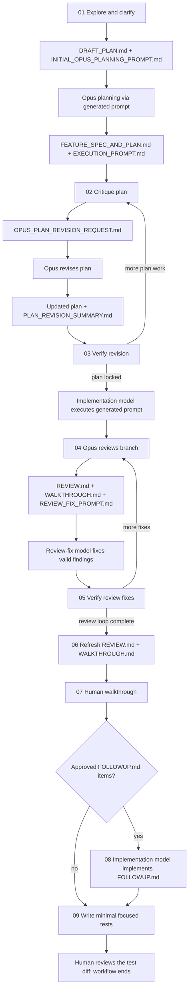

# AI Coding Workflow

A prompt pack for clarification, planning, implementation, code review, human approval, and focused tests.

Run prompts in the target code repository. This repository stores the workflow source. Paste each checked-in or generated prompt into a fresh repository-aware model session; named artifacts in the target repository root carry context between phases.

## Workflow

```mermaid
flowchart TD
    A["01 Explore and clarify"] --> B["DRAFT_PLAN.md + INITIAL_OPUS_PLANNING_PROMPT.md"]
    B --> C["Opus planning via generated prompt"]
    C --> D["FEATURE_SPEC_AND_PLAN.md + EXECUTION_PROMPT.md"]
    D --> E["02 Critique plan"]
    E --> F["OPUS_PLAN_REVISION_REQUEST.md"]
    F --> G["Opus revises plan"]
    G --> H["Updated plan + PLAN_REVISION_SUMMARY.md"]
    H --> I["03 Verify revision"]
    I -- "more plan work" --> E
    I -- "plan locked" --> J["Implementation model executes generated prompt"]
    J --> K["04 Opus reviews branch"]
    K --> L["REVIEW.md + WALKTHROUGH.md + REVIEW_FIX_PROMPT.md"]
    L --> M["Review-fix model fixes valid findings"]
    M --> N["05 Verify review fixes"]
    N -- "more fixes" --> K
    N -- "review loop complete" --> O["06 Refresh REVIEW.md + WALKTHROUGH.md"]
    O --> P["07 Human walkthrough"]
    P --> Q{"Approved FOLLOWUP.md items?"}
    Q -- "yes" --> R["08 Implementation model implements FOLLOWUP.md"]
    Q -- "no" --> S["09 Write minimal focused tests"]
    R --> S
    S --> T["Human reviews the test diff; workflow ends"]
```

## Prompt index

| Step | Prompt | Model / role | Result |
|---|---|---|---|
| 01 | [Initial exploration](prompts/01_initial_exploration_any_model.md) | Any capable repo-aware model | `DRAFT_PLAN.md`, `INITIAL_OPUS_PLANNING_PROMPT.md` |
| 02 | [Plan critique](prompts/02_plan_critique_any_model.md) | Any capable repo-aware model | `PLAN_CRITIQUE.md`, `OPUS_PLAN_REVISION_REQUEST.md` |
| 03 | [Plan-revision verification](prompts/03_plan_revision_verification_any_model.md) | Any capable repo-aware model | `PLAN_REVISION_VERIFICATION.md` |
| 04 | [Implemented-branch review](prompts/04_opus_review_branch.md) | Claude Opus | `REVIEW.md`, `WALKTHROUGH.md`, `REVIEW_FIX_PROMPT.md` |
| 05 | [Review-fix verification](prompts/05_opus_verify_review_fixes.md) | Claude Opus | `REVIEW_FIX_VERIFICATION.md` |
| 06 | [Final review-artifact refresh](prompts/06_opus_refresh_review_and_walkthrough.md) | Claude Opus | Refreshed `REVIEW.md` and `WALKTHROUGH.md` |
| 07 | [Human code walkthrough](prompts/07_human_code_walkthrough.md) | Any capable repo-aware model with a human | Human-approved `FOLLOWUP.md`, when needed |
| 08 | [Human follow-up implementation](prompts/08_implement_human_followup_any_model.md) | Any capable repo-aware model | Approved follow-up changes |
| 09 | [Focused test writing](prompts/09_write_focused_tests_any_model.md) | Any capable repo-aware model | Test-file changes only, followed by human review |

Generated prompts are the sole prompt input for their handoff: `INITIAL_OPUS_PLANNING_PROMPT.md` for Opus planning, `OPUS_PLAN_REVISION_REQUEST.md` for Opus revision, `EXECUTION_PROMPT.md` for implementation, and `REVIEW_FIX_PROMPT.md` for fixes. They contain their own skills and contracts. If one is incomplete, return to its producer instead of adding another prompt.

## Running the workflow

1. Start at `01` with a rough idea, or `02` with complete planning artifacts. After `01`, paste its generated prompt into Opus to create `FEATURE_SPEC_AND_PLAN.md` and `EXECUTION_PROMPT.md`.
2. Run `02`, use its generated Opus revision request if needed, then run `03`. Repeat until the plan is locked. If no revision was needed, `03` verifies the unchanged artifacts without requiring a revision summary.
3. Paste `EXECUTION_PROMPT.md` into a capable coding model. Run `04`, execute its generated fix prompt when there are valid findings, and run `05`. Repeat until all valid blocking and non-blocking findings are resolved.
4. Run `06` to refresh review artifacts, then `07` for independent human review. `AGREE` approves a specific follow-up item; `RESOLVE` advances a fully reviewed file. Run `08` only for approved `FOLLOWUP.md` work.
5. Run `09` on the final implementation. It changes test files only; human review of the test diff ends the workflow.

You can start at `04` with an existing implementation branch. Planning artifacts are optional in standalone review and fixes; use the diff against `main` and repository evidence when they are absent. You can also resume at locked execution, human review, approved follow-up, or focused tests when that phase's inputs and gates are satisfied.

## Contracts and artifacts

- Use one prompt per phase, with explicit skills and self-contained instructions. Duplication across prompts is intentional; there is no skill router or reliance on hidden chat history.
- The default planning output is `FEATURE_SPEC_AND_PLAN.md` plus `EXECUTION_PROMPT.md`. Its implementation-plan section is the execution contract and links to spec/reference anchors. Separate `SPEC.md` and `IMPLEMENTATION_PLAN.md` are fallback-only.
- Store workflow artifacts only in the target root under exact filenames. Include `Created by`, `Created at`, and `Updated at`; preserve creation fields and refresh the update field on edits. Do not stage or commit workflow artifacts unless explicitly requested.
- Implementation/fix phases complete focused verification, stage intended changes with `git add`, commit, push, verify remote status, and create a PR only when the branch has none. GitHub CLI (`gh`) is the fallback for checking PR existence. Phase `08` keeps each commit tied to one approved follow-up item.
- Resolve repository facts through inspection. Ask about missing material decisions and conflicts; keep authorized execution moving when no blocker remains. Preserve scope, backwards compatibility, and Linux/Windows support.

| Artifact | Producer | Main consumer |
|---|---|---|
| `DRAFT_PLAN.md` | 01 | Generated Opus planning prompt |
| `INITIAL_OPUS_PLANNING_PROMPT.md` | 01 | Main Opus planning pass |
| `FEATURE_SPEC_AND_PLAN.md` | Opus planning/revision | Critique, execution, and review phases |
| `EXECUTION_PROMPT.md` | Opus planning/revision | Locked implementation |
| `PLAN_CRITIQUE.md` | 02 | Opus revision and 03 |
| `OPUS_PLAN_REVISION_REQUEST.md` | 02 | Opus revision |
| `PLAN_REVISION_SUMMARY.md` | Opus revision | 03 |
| `PLAN_REVISION_VERIFICATION.md` | 03 | Execution gate |
| `REVIEW.md` | 04, refreshed by 06 | Review-fix context and later workflow context |
| `WALKTHROUGH.md` | 04, refreshed by 06 | Review-fix and human walkthrough context |
| `REVIEW_FIX_PROMPT.md` | 04 | Review-fix pass |
| `REVIEW_FIX_VERIFICATION.md` | 05 | 06 |
| `FOLLOWUP.md` | 07 | 08 |

## Documentation checkpoints

Planning identifies each step's exact durable user-, operator-, API-, configuration-, or developer-facing documentation and validation, or records an evidence-based `Not applicable` decision. A planning checkpoint passes when those actions are specified; implementation and fix phases must execute them in the same change set.

Critique, review, verification, refresh, and human walkthrough inspect the evidence and report gaps. Code comments, commit messages, and workflow artifacts do not replace durable documentation. Phase `09` verifies prior documentation checkpoints and stops/escalates unresolved gaps without editing docs.

## Testing policy

Earlier phases inspect or run focused existing tests; phase `09` owns test authoring. Test items in `FOLLOWUP.md` remain deferred until `09`.

Write the fewest distinct behavior/regression tests, with small readable functions, deterministic isolation, and existing fixtures, native framework APIs, and installed extensions. Never mock the subject under test; limit mocks to impractical external collaborators. Require at least 85% coverage for new or changed lines using existing tooling, without changing coverage configuration or adding coverage-only tests. Do not claim changed-line coverage from a broader measurement.

For Python/pytest, prefer pytest fixtures and APIs over hand-rolled infrastructure. Other languages and non-pytest projects retain their established frameworks. Phase `09` changes only test files and test-local support, retains no generated coverage output, and creates no prompt, plan, review, walkthrough, summary file, or other workflow artifact. No AI phase follows it.

## Skills

Every prompt explicitly links its complete skill set on GitHub, including skills to embed in generated prompts. Read each applicable skill and required companion completely before using it; reuse that content during the session. Phase `01` links both `grill-me` and its required `grilling` procedure so it does not depend on an installed slash command. Existing skill assignments are preserved.

Phase `09` retains its local-loading gate: enter `../ai-skills-archive`, run `git pull --ff-only origin main`, read the shared and applicable language-specific skills and required evaluator, then return to the target repository. The path after `/blob/main/` in each GitHub link maps to its local archive path. Missing files or a failed pull block the phase; remote content is not a fallback for this gate.

Every checked-in and generated prompt requires [no-ai-slop](https://github.com/viseshrp/ai-skills-archive/blob/main/archives/petergyang__no-ai-slop/snapshot/skills/no-ai-slop/SKILL.md) and its [eval.md](https://github.com/viseshrp/ai-skills-archive/blob/main/archives/petergyang__no-ai-slop/snapshot/skills/no-ai-slop/eval.md). Apply them while drafting and before saving Markdown or sending the final response. They are the ultimate prose/presentation guide after factual, technical, structural, and output requirements are met. Stop before writing Markdown if either cannot be read and applied. They cannot change scope, meaning, artifact names, constraints, or evidence. Ignore their draft-request, detection-mode, and mandatory `What changed` workflows unless a phase asks for them.

## Current model guidance

The September 5, 2026 audit follows current [OpenAI prompting guidance](https://developers.openai.com/api/docs/guides/latest-model) and [Claude prompting guidance](https://platform.claude.com/docs/en/build-with-claude/prompt-engineering/claude-prompting-best-practices): explicit outcomes and boundaries, limited repeated instructions, batched independent reads, and verification proportional to the task. These are prompt-design choices, not a measured speed or quality improvement.

Keep model roles version-neutral: Claude Opus for planning, revision, and AI review; any capable repository-aware model for the other phases. Choose a supported release in the agent interface rather than embedding release IDs, reasoning budgets, or vendor-specific tools in the prompts. The human walkthrough retains its explicit `gh` requirement. Required output structures and line-by-line walkthroughs take priority over brevity.

## Repository maintenance

Read [AGENTS.md](AGENTS.md) before editing. Canonical files are `prompts/*.md`, `README.md`, and `AGENTS.md`. Keep phase order, artifact names, model roles, skill links, and repeated contracts synchronized.

Everything under `sources/` is immutable reference input, including the [historical skill inventory](sources/current_skill_set.txt) and [original prompts](sources/original_scrappy_prompts.txt). The [archived consolidated pack](archived/agentic_coding_prompt_pack_refactored.md) is historical and changes only when explicitly requested. Do not create runtime workflow artifacts in this repository by default.
