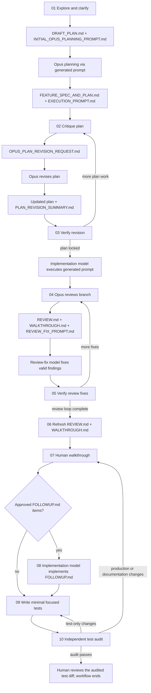

# AI Coding Workflow

A phase-based prompt pack for moving a coding task from clarification to planning, implementation, review, human approval, focused tests, and an independent test audit.

Use this repository as the workflow source; make application changes in the target repository. Copy each checked-in prompt into a fresh model session with the target code repository open. Runtime artifacts such as `DRAFT_PLAN.md`, `FEATURE_SPEC_AND_PLAN.md`, `REVIEW.md`, and `TEST_AUDIT.md` belong in the target repository root.

## Workflow


```mermaid
flowchart TD
    A["01 Explore and clarify"] --> B["DRAFT_PLAN.md + INITIAL_OPUS_PLANNING_PROMPT.md"]
    B --> C["Opus planning via generated prompt"]
    C --> D["FEATURE_SPEC_AND_PLAN.md + EXECUTION_PROMPT.md"]
    D --> E["02 Critique plan"]
    E --> F["OPUS_PLAN_REVISION_REQUEST.md"]
    F --> G["Opus revises plan"]
    G --> H["Updated plan + PLAN_REVISION_SUMMARY.md"]
    H --> I["03 Verify revision"]
    I -- "more plan work" --> E
    I -- "plan locked" --> J["Implementation model executes generated prompt"]
    J --> K["04 Opus reviews branch"]
    K --> L["REVIEW.md + WALKTHROUGH.md + REVIEW_FIX_PROMPT.md"]
    L --> M["Review-fix model fixes valid findings"]
    M --> N["05 Verify review fixes"]
    N -- "more fixes" --> K
    N -- "review loop complete" --> O["06 Refresh REVIEW.md + WALKTHROUGH.md"]
    O --> P["07 Human walkthrough"]
    P --> Q{"Approved FOLLOWUP.md items?"}
    Q -- "yes" --> R["08 Implementation model implements FOLLOWUP.md"]
    Q -- "no" --> S["09 Write minimal focused tests"]
    R --> S
    S --> T["10 Independent test audit"]
    T -- "test-only changes" --> S
    T -- "production or documentation changes" --> P
    T -- "audit passes" --> U["Human reviews the audited test diff; workflow ends"]
```

Generated prompt artifacts are the only prompt input for their handoff:

- `INITIAL_OPUS_PLANNING_PROMPT.md` drives the main Opus planning pass.
- `OPUS_PLAN_REVISION_REQUEST.md` drives an Opus plan-revision pass.
- `EXECUTION_PROMPT.md` drives locked implementation.
- `REVIEW_FIX_PROMPT.md` drives a review-fix pass.

If a generated prompt is incomplete, return to its producer phase instead of inventing a parallel checked-in prompt.

## Prompt Index

| Step | Prompt | Model / role | Result |
|---|---|---|---|
| 01 | [Initial exploration](prompts/01_initial_exploration_any_model.md) | Any capable repo-aware model | `DRAFT_PLAN.md`, `INITIAL_OPUS_PLANNING_PROMPT.md` |
| 02 | [Plan critique](prompts/02_plan_critique_any_model.md) | Any capable repo-aware model | `PLAN_CRITIQUE.md`, `OPUS_PLAN_REVISION_REQUEST.md` |
| 03 | [Plan-revision verification](prompts/03_plan_revision_verification_any_model.md) | Any capable repo-aware model | `PLAN_REVISION_VERIFICATION.md` |
| 04 | [Implemented-branch review](prompts/04_opus_review_branch.md) | Claude Opus | `REVIEW.md`, `WALKTHROUGH.md`, `REVIEW_FIX_PROMPT.md` |
| 05 | [Review-fix verification](prompts/05_opus_verify_review_fixes.md) | Claude Opus | `REVIEW_FIX_VERIFICATION.md` |
| 06 | [Final review-artifact refresh](prompts/06_opus_refresh_review_and_walkthrough.md) | Claude Opus | Refreshed `REVIEW.md` and `WALKTHROUGH.md` |
| 07 | [Human code walkthrough](prompts/07_human_code_walkthrough.md) | Any capable repo-aware model with a human | Human-approved `FOLLOWUP.md`, when needed |
| 08 | [Human follow-up implementation](prompts/08_implement_human_followup_any_model.md) | Any capable repo-aware model | Approved follow-up changes |
| 09 | [Focused test writing](prompts/09_write_focused_tests_any_model.md) | Any capable repo-aware model | Test-file changes only, followed by phase-10 audit |
| 10 | [Independent test audit](prompts/10_test_audit_any_model.md) | Any capable repo-aware agent | `TEST_AUDIT.md`, followed by human review after approval |

The main Opus planning pass, Opus plan-revision pass, locked implementation pass, and review-fix pass use generated prompts, so they do not have separate checked-in phase files.

## Optional Independent Phases

These phases run only when explicitly requested. Their numbers identify standalone prompts; they are not steps after `10`, prerequisites for the main workflow, or substitutes for its approval gates. The main workflow still ends with human review of the audited test diff.

| Phase | Prompt | Model / role | Result |
|---|---|---|---|
| 11 | [Repository complexity audit](prompts/11_optional_complexity_audit_any_model.md) | Any capable repo-aware agent | Read-only findings in chat; no file or Git changes |
| 12 | [UI prototyping](prompts/12_optional_ui_prototyping_any_model.md) | Any capable repo-aware model with a human | Isolated previews under `.ui-prototypes/<slug>/` and `UI_PROTOTYPE.md`; explicit human selection before planning |

Use `11` to inspect repository complexity, including backend code. It uses `ponytail-audit` and its `ponytail-review` companion, ranks supported findings by maintenance benefit and risk, and checks callers and contracts before recommending deletion. Select findings before taking them to `01`; an active human walkthrough still requires `AGREE` and the final go-ahead for follow-up work.

Use `12` when choosing between UI directions before locking a plan. It uses `prototype`, its required `PICKER.md`, and `emil-design-eng` for isolated web UI variants. It creates no production changes, tests, dependencies, commits, or pull requests. A native UI request needs a compatible approach agreed before construction. A selected variant and `UI_PROTOTYPE.md` become context for `01`; selection does not authorize production integration. Keep previews available through selection and plan their cleanup explicitly.

## How to Run It

1. Open the target code repository in a repo-aware agent UI. Keep this prompt pack available only as the instruction source.
2. Run [prompt 01](prompts/01_initial_exploration_any_model.md) with the task. It creates `DRAFT_PLAN.md` and `INITIAL_OPUS_PLANNING_PROMPT.md`.
3. Paste `INITIAL_OPUS_PLANNING_PROMPT.md` into Opus. Save the resulting `FEATURE_SPEC_AND_PLAN.md` and `EXECUTION_PROMPT.md`.
4. Run [prompt 02](prompts/02_plan_critique_any_model.md). If revision is required, paste its generated `OPUS_PLAN_REVISION_REQUEST.md` into Opus.
5. Run [prompt 03](prompts/03_plan_revision_verification_any_model.md). Repeat `02 -> Opus revision -> 03` until the plan is locked.
6. Paste `EXECUTION_PROMPT.md` into any capable repository-aware coding model to implement `FEATURE_SPEC_AND_PLAN.md`.
7. Run [prompt 04](prompts/04_opus_review_branch.md). If it creates `REVIEW_FIX_PROMPT.md`, paste that generated prompt into any capable repository-aware coding model, then run [prompt 05](prompts/05_opus_verify_review_fixes.md). Repeat until all valid blocking and non-blocking findings are resolved.
8. Run [prompt 06](prompts/06_opus_refresh_review_and_walkthrough.md), then use [prompt 07](prompts/07_human_code_walkthrough.md) for independent human review. Start with a code mindmap and success/error flows in chat; discuss small semantic blocks using focused diffs, pseudocode for material logic changes, and excerpts for referenced declarations and definitions. Keep these visuals in chat only; `WALKTHROUGH.md` retains source excerpts and prose context. Approve follow-up items with `AGREE`. After `RESOLVE`, the model rechecks the file and verifies it is marked Viewed on the PR through `gh` before advancing; failures keep completion pending.
9. If the human approves follow-up work, record it in `FOLLOWUP.md` and run [prompt 08](prompts/08_implement_human_followup_any_model.md).
10. Run [prompt 09](prompts/09_write_focused_tests_any_model.md) against the final branch state.
11. Run [prompt 10](prompts/10_test_audit_any_model.md) with any capable repository-aware agent. If it reports test-only findings, return to `09`, then repeat `10`. Route findings that require production or documentation changes through the human approval and follow-up path before repeating `09` and `10`.
12. Human-review the audited test diff after phase `10` passes.

You may also start directly at [prompt 04](prompts/04_opus_review_branch.md) for an existing implementation branch. Earlier planning and execution artifacts are optional: when absent, Opus reviews the branch against `main` and repository evidence; when present, it also treats them as authoritative review context.

Use a fresh chat for each major phase or model handoff. Use artifact files for handoffs; do not depend on hidden chat history.

## Operator Rules

- Run the workflow in the target code repository, never in this prompt-pack repository.
- Store every workflow-generated Markdown artifact in the target repository root under its exact required filename.
- Give each generated artifact `Created by`, `Created at`, and `Updated at` fields. Preserve the creation fields and refresh `Updated at` on edits.
- Treat the implementation-plan section of `FEATURE_SPEC_AND_PLAN.md` as the execution contract and its spec/reference section as context.
- Use the checked-in prompt for checked-in phases and the generated artifact for generated phases.
- Do not stage or commit workflow-generated Markdown artifacts unless explicitly requested.
- Execution phases verify their work, stage intended source/test changes, create focused commits, push the current branch, and create a pull request only when that branch does not already have one. GitHub CLI (`gh`) is the fallback for checking PR existence.
- Documentation is a required checkpoint, not final cleanup: at every planning, implementation, review, verification, and human-handoff stage, record either the exact durable documentation updated and its validation evidence or an evidence-based `Not applicable` decision. Implementation and fix stages complete applicable documentation in the same change set. Phases `09` and `10` verify this status but cannot edit documentation.
- Stop and ask when required decisions, repository facts, or instructions conflict. Do not fill material gaps with assumptions.

## Artifact Chain

| Artifact | Producer | Main consumer |
|---|---|---|
| `DRAFT_PLAN.md` | 01 | Generated Opus planning prompt |
| `INITIAL_OPUS_PLANNING_PROMPT.md` | 01 | Main Opus planning pass |
| `FEATURE_SPEC_AND_PLAN.md` | Opus planning/revision | Critique, execution, and review phases |
| `EXECUTION_PROMPT.md` | Opus planning/revision | Locked implementation |
| `PLAN_CRITIQUE.md` | 02 | Opus revision and 03 |
| `OPUS_PLAN_REVISION_REQUEST.md` | 02 | Opus revision |
| `PLAN_REVISION_SUMMARY.md` | Opus revision | 03 |
| `PLAN_REVISION_VERIFICATION.md` | 03 | Execution gate |
| `REVIEW.md` | 04, refreshed by 06 | Review-fix context and later workflow context |
| `WALKTHROUGH.md` | 04, refreshed by 06 | Review-fix and human walkthrough context |
| `REVIEW_FIX_PROMPT.md` | 04 | Review-fix pass |
| `REVIEW_FIX_VERIFICATION.md` | 05 | 06 |
| `FOLLOWUP.md` | 07 | 08 |
| `TEST_AUDIT.md` | 10 | Human reviewer; 09 when test-only findings require another pass |
| `UI_PROTOTYPE.md` | Optional 12 | Human selection; 01 when planning is requested |

Prompt 09 changes test files only. It must not create another prompt, review, walkthrough, plan, summary, or workflow Markdown artifact, and it must not leave generated coverage output in the repository. Prompt 10 then performs a read-only audit, writes only `TEST_AUDIT.md`, and routes supported findings to the correct earlier phase. Human review of the audited test diff ends the workflow after phase 10 passes.

## Core Design

- One prompt input per phase. A generated downstream prompt replaces a separate checked-in prompt for that handoff.
- Prompts are self-contained. Repeated skill and Engineering Contract blocks are intentional.
- Main implementation, review fixes, and human follow-up receive the same applicable engineering requirements used in review. Generated execution and fix prompts are checked for complete contracts before handoff; planning critique and verification block incomplete execution prompts.
- No skill router. Each prompt lists only the supporting skills relevant to its phase, and the prompt always wins over a skill.
- The default planning output is one combined `FEATURE_SPEC_AND_PLAN.md` plus a separate `EXECUTION_PROMPT.md`. Separate `SPEC.md` and `IMPLEMENTATION_PLAN.md` files are fallback-only.
- Claude Opus is reserved for planning, revision, and implementation review. Every other model-run phase accepts any capable repository-aware model or agent.
- Planning and AI review each have a verification loop. Human review remains an independent approval gate.
- Phase 09 adds the smallest meaningful focused test set. The final automated phase independently audits those tests before human review.

## Simplicity and Reuse

Every phase applies a simplicity and reuse procedure to backend and UI work within its existing permissions:

- inspect existing code, standard-library capabilities, native platform features, and installed dependencies before proposing custom code,
- justify new abstractions and dependencies by current requirements or necessary ownership boundaries,
- trace relevant callers before choosing a bug-fix location and verify references and contracts before proposing deletion,
- preserve readability, compatibility, validation, security, and verification; fewer lines are not an acceptance criterion.

These rules draw from [Ponytail](https://github.com/viseshrp/ai-skills-archive/blob/main/archives/DietrichGebert__ponytail/snapshot/skills/ponytail/SKILL.md) and [ponytail-review](https://github.com/viseshrp/ai-skills-archive/blob/main/archives/DietrichGebert__ponytail/snapshot/skills/ponytail-review/SKILL.md). The rules are embedded in the prompts; these provenance links do not activate either skill. Persistent modes, line-count scoring, production assertion demos, test quotas, debt markers, and separate ledgers are excluded. Existing scope, dependency approval, and test-phase boundaries still apply.

Deliberate simplifications with material limits must name why they meet current requirements, their known limit, and the evidence that would trigger revisiting them. Record these decisions in existing planning sections and carry applicable limits into durable documentation during authorized implementation. Review and audit phases verify them through the existing documentation checkpoint.

Reviews and handoffs must support latency, memory, or cost improvement claims with comparable before-and-after measurements. Identify the baseline, changed version, workload, method, and relevant environment; otherwise label the expected improvement `unmeasured`. This adapts [ponytail-gain's honesty boundary](https://github.com/viseshrp/ai-skills-archive/blob/main/archives/DietrichGebert__ponytail/snapshot/skills/ponytail-gain/SKILL.md); the provenance link does not activate the skill or its benchmark scoreboard. These rules add no comment markers, debt ledger, benchmark infrastructure, or workflow artifacts.

## UI Work Only

Phases `01` through `11` and generated downstream prompts have a separate `## UI work only` section. Enable it only when the task or reviewed change includes UI behavior, layout, presentation, or interaction. Backend-only work skips the section, including its skill downloads, questions, checks, and reporting. A backend service having UI consumers does not by itself enable it. Phase `12` is entirely UI prototyping: its skills and requirements apply directly, without a separate UI activation gate.

| Stage | UI requirements when applicable |
|---|---|
| 01 and generated planning | Resolve data and state cases, keyboard and touch behavior, motion purpose, acceptance checks, and documentation impact. |
| 02, generated revision, and 03 | Critique and verify those decisions and the complete conditional UI contract in the actual execution prompt. |
| Generated execution, review fixes, and 08 | Implement approved UI behavior with existing components and tokens; verify interactions using existing facilities and report required checks still pending. |
| 04 through 07 | Review changed behavior, verify accepted fixes, refresh evidence, and conduct independent human review under the existing approval gates. |
| 09 and 10 | Write and independently audit the smallest meaningful behavior tests; distinguish automated proof from visual or device checks. |

The conditional skill set comes from the archived [Emil Kowalski collection](https://github.com/viseshrp/ai-skills-archive/tree/main/archives/emilkowalski__skills/snapshot/skills):

- `emil-design-eng` for web UI design decisions and `animation-vocabulary` when a requested motion effect needs clarification,
- `break-ui` with `CATALOG.md` for applicable realistic data and state cases, using its analysis only,
- `animate` with `RECIPES.md` for web motion construction, with `pick-ui-library` only when that work requires selecting a UI primitive,
- `review-animations` with `STANDARDS.md` for changed web motion,
- `mobile-native` for mobile-web behavior.

Each prompt carries the full GitHub links for its applicable skills and companions. Web-specific guidance applies only to web UI. Existing design decisions and tokens take precedence over recipe values; aesthetic preferences do not become required fixes without evidence of a defect or contract mismatch. Verify version-sensitive APIs and performance claims against the target stack.

UI skills do not authorize prototypes, development toggles, extra reports, dependencies, or a new workflow phase. Phase 09 alone may author test-local fixtures. Keep UI evidence in existing artifacts or chat, and identify observed behavior, code-only conclusions, and required browser or device checks still pending. Preserve documentation checkpoints, `AGREE`, `RESOLVE`, and the final human approval gates.

The isolated preview and `UI_PROTOTYPE.md` in optional phase `12` are the only prototype exception. This exception applies only when that phase is explicitly requested; the other phases retain their existing UI restrictions. Prototype sample data stays local to the preview and does not authorize shared test fixtures. Optional phase `11` applies only the complexity evidence bar to UI code and adds no visual audit or UI skill downloads.

## Documentation Checkpoints

Documentation follows the same gate discipline as code and verification:

- Planning phases identify the durable user-, operator-, API-, configuration-, and developer-facing documentation affected by every implementation step, or explain why none applies.
- Implementation, review-fix, and human-follow-up phases update and validate the affected documentation in the same change set before they mark the step complete.
- Critique, review, verification, refresh, and human-walkthrough phases check the result against the actual branch and record missing documentation as an issue or approved follow-up item.
- Phases 09 and 10 must verify that the prior documentation checkpoint passed and stop/escalate an unresolved gap instead of editing documentation.

Optional phase `11` identifies the documentation impact of proposed changes in chat without editing files. Optional phase `12` records the selected design's documentation impact, planned validation, or evidence-based `Not applicable` decision in `UI_PROTOTYPE.md`; durable documentation changes wait for authorized implementation.

## Testing Policy

Earlier phases may inspect or run focused tests, but they do not author tests. Prompt 09 owns the complete test-writing contract:

- write the fewest nonduplicative tests for uncovered changed behavior and material regression risks; a bug fix alone does not justify a new regression test,
- prefer extending existing tests and consolidating trivial tests of the same behavior when assertions and failure diagnostics stay clear,
- keep tests behavior-focused, deterministic, isolated, and small enough to read linearly; reject tautological or self-testing tests and change detectors that freeze implementation details without an observable contract,
- follow the repository's existing test-framework configuration and reuse its fixtures, native APIs, and installed extensions instead of hand-rolled test infrastructure,
- never patch or mock the subject under test itself; patch only impractical external collaborators and avoid implementation-detail assertions,
- reach at least 85% coverage for new or changed lines without weakening coverage configuration or adding coverage-only tests,
- change test files only, then hand the test diff to phase 10 without generating another prompt or workflow artifact.

### Language-specific testing guidance

- **Python / pytest:** follow the existing pytest configuration and reuse fixtures, native APIs, and installed plugins instead of hand-rolled Python or standard-library mechanisms. Use `monkeypatch` for external collaborators when it fits; never monkeypatch the subject under test.
- **Other languages:** follow the repository's established test runner, framework conventions, and installed extensions. Do not introduce or migrate a test framework during phase 09.

The full test-authoring policy is in [phase 09](prompts/09_write_focused_tests_any_model.md). The independent value, duplication, brittleness, and test-seam audit is in [phase 10](prompts/10_test_audit_any_model.md).

## Skills

Current skill references live in the prompts that use them. [sources/current_skill_set.txt](sources/current_skill_set.txt) is a preserved historical input, not a synchronization target.

Skills support the workflow; they do not widen scope or override prompt constraints. Phase 07 uses [show-me](https://github.com/viseshrp/ai-skills-archive/blob/main/archives/humanlayer__skills/snapshot/plugins/show-me/skills/show-me/SKILL.md) for chat-only walkthrough visuals; no installation is required.

Every prompt includes explicit GitHub links to its skills and required companions. Generated prompts carry their own complete skill links and handling rules. Phase 01 includes [grilling](https://github.com/viseshrp/ai-skills-archive/blob/main/archives/mattpocock__skills/snapshot/skills/productivity/grilling/SKILL.md), the procedure required by `grill-me`. Every phase fetches skills and required companions from their GitHub links without depending on a local skill repository or installation.

Every checked-in phase and every generated downstream prompt must use [no-ai-slop](https://github.com/viseshrp/ai-skills-archive/blob/main/archives/petergyang__no-ai-slop/snapshot/skills/no-ai-slop/SKILL.md) and its [eval.md](https://github.com/viseshrp/ai-skills-archive/blob/main/archives/petergyang__no-ai-slop/snapshot/skills/no-ai-slop/eval.md). For every Markdown document a phase creates or revises, this is a hard requirement and the ultimate writing guide. It is the final authority for prose and presentation after the phase's factual, technical, structural, and output requirements are satisfied. The model must apply it while drafting, run the evaluator before saving each Markdown artifact, and stop before writing Markdown if either file cannot be read and applied. This writing rule cannot change scope, meaning, required structure, artifact names, constraints, or evidence. Each prompt disables the draft-request, detection-mode, and mandatory `What changed` workflow unless the phase explicitly needs one of them.

Phase 10 also uses the repository-maintained [test-audit](https://github.com/viseshrp/ai-skills-archive/blob/main/skills/test-audit/SKILL.md) skill. It applies a language-neutral value bar with separate Python and JavaScript/TypeScript guidance and remains read-only under the phase prompt.

Skill procedures, evaluators, and companion resources must come from `viseshrp/ai-skills-archive`, including relative references embedded in a skill. Do not substitute upstream or official-source skill copies when an archived file is missing. Report the missing path instead. This does not replace the target-library API/version documentation required by the Engineering Contract.

The explicit companion links include `eval.md`, the idea-refinement frameworks, rubric, and examples, the Definition of Done, security and performance checklists and patterns, stack-discovery testing guidance, `CATALOG.md`, `RECIPES.md`, `STANDARDS.md`, and `PICKER.md`. Follow only procedures applicable to the current phase; preserve UI activation, test-authoring limits, and named artifacts. Optional bootstrap scripts, separate skill workflows, and provenance-only links do not activate extra work. Generated prompts must carry the same archive-only source rule and complete applicable links.

## Repository Layout

```text
.
+-- AGENTS.md
+-- README.md
+-- prompts/
|   +-- 01_initial_exploration_any_model.md
|   +-- 02_plan_critique_any_model.md
|   +-- 03_plan_revision_verification_any_model.md
|   +-- 04_opus_review_branch.md
|   +-- 05_opus_verify_review_fixes.md
|   +-- 06_opus_refresh_review_and_walkthrough.md
|   +-- 07_human_code_walkthrough.md
|   +-- 08_implement_human_followup_any_model.md
|   +-- 09_write_focused_tests_any_model.md
|   +-- 10_test_audit_any_model.md
|   +-- 11_optional_complexity_audit_any_model.md
|   +-- 12_optional_ui_prototyping_any_model.md
+-- sources/
|   +-- current_skill_set.txt
|   +-- original_scrappy_prompts.txt
|   +-- chat_exports/
|   +-- *.pdf
+-- archived/
    +-- agentic_coding_prompt_pack_refactored.md
```

- `prompts/` is the canonical product surface.
- `sources/` preserves immutable original/reference inputs and rationale. Never edit files there.
- `archived/` is historical reference, not the default editing surface.
- `AGENTS.md` defines maintenance and synchronization rules.

## Common Entry Points

- Start at 01 when the task still needs clarification.
- Start at 02 when complete planning artifacts already exist.
- Start with generated implementation when the plan is already locked.
- Start at 04 when implementation exists and needs the AI review loop.
- Start at 07 when the AI loop is complete and human review should begin.
- Start at 08 when `FOLLOWUP.md` already contains only approved work.
- Start at 09 when the final branch behavior is ready for focused tests.
- Start at 10 when the final test diff is ready for an independent audit.
- Run optional 11 only when a repository complexity audit is requested.
- Run optional 12 only when UI prototypes are requested before planning.

## Maintenance

Read [AGENTS.md](AGENTS.md) before editing the pack. Keep filenames, artifact names, phase order, model roles, skill placement, and intentionally duplicated contracts synchronized.

Useful references:

- [Historical skill inventory](sources/current_skill_set.txt)
- [Original prompt source](sources/original_scrappy_prompts.txt)
- [Historical consolidated prompt pack](archived/agentic_coding_prompt_pack_refactored.md)

Never edit anything under `sources/`; those files are immutable originals or reference inputs. Treat archive material as historical unless a task explicitly targets the archive.
